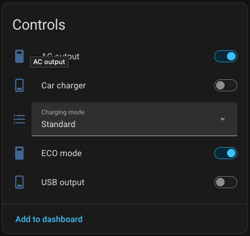
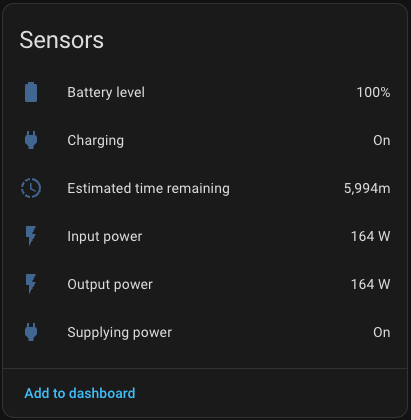

# ALLPOWERS VOLIX P1800 for Home Assistant

A local Home Assistant integration for monitoring and controlling the ALLPOWERS VOLIX P1800 power station over Bluetooth. It operates without an ALLPOWERS cloud account.

## Features

- Automatic Bluetooth discovery
- Battery level
- Input and output power
- Estimated remaining runtime
- Charging and power-supply status
- AC output control
- USB output control
- Car-charger/12 V output control
- ECO mode control
- Mute, Standard and Fast charging-mode selection

## Screenshots

<table>
  <tr>
    <td align="center"><strong>Controls</strong></td>
    <td align="center"><strong>Sensors</strong></td>
  </tr>
  <tr>
    <td></td>
    <td></td>
  </tr>
</table>
## Compatibility

The integration has been tested with a physical VOLIX P1800 using an ESP32-C3 active Bluetooth proxy. Home Assistant can also use a compatible local Bluetooth adapter or another connectable Bluetooth proxy, although other proxy hardware has not yet been verified by this project.

Support for other ALLPOWERS power-station models is not currently claimed.

Home Assistant selects the available Bluetooth connection automatically; the integration does not bind the station to a specific adapter or proxy. Keep the station within reliable Bluetooth range. Because the station normally accepts only one Bluetooth client at a time, disconnect the official mobile application before configuring or using the integration.

## Installation with HACS

1. In HACS, add this repository as a custom repository with the **Integration** category.
2. Download **ALLPOWERS VOLIX P1800**.
3. Restart Home Assistant.
4. Open **Settings -> Devices & services**.
5. Accept the discovered VOLIX P1800, or select **Add integration -> ALLPOWERS VOLIX P1800** and choose the detected station.

If no station is listed, confirm that it is powered on, disconnected from the official mobile application and visible to a connectable Home Assistant Bluetooth adapter or active Bluetooth proxy.

## Optional ESPHome Bluetooth proxy

An ESPHome Bluetooth proxy can extend Bluetooth coverage when the Home Assistant host is not close enough to the station. The proxy must use `active: true` because the integration connects to the station, subscribes to notifications and sends commands.

The following example matches the ESP32-C3 configuration used during development. Store the referenced values in the ESPHome `secrets.yaml` file.

```yaml
esphome:
  name: volix-bluetooth-proxy
  friendly_name: VOLIX Bluetooth Proxy

esp32:
  board: esp32-c3-devkitm-1
  framework:
    type: esp-idf

logger:

wifi:
  ssid: !secret wifi_ssid
  password: !secret wifi_password

api:
  encryption:
    key: !secret bluetooth_proxy_api_key

ota:
  - platform: esphome
    password: !secret bluetooth_proxy_ota_password

esp32_ble_tracker:

bluetooth_proxy:
  active: true
```

Do not configure a dedicated `esp32_ble_client` for the station on the proxy. The Home Assistant integration manages the BLE connection itself.

For additional proxy options, see the [ESPHome Bluetooth Proxy documentation](https://esphome.io/components/bluetooth_proxy/) and [Home Assistant Bluetooth documentation](https://www.home-assistant.io/integrations/bluetooth/).

## Project status

Version `0.1.3` is an early release tested against a physical VOLIX P1800. Feedback and testing with other compatible Home Assistant Bluetooth adapters and ESP32 proxy boards are welcome.

## Credits

The Bluetooth packet format is based on the MIT-licensed [`madninjaskillz/allpowers-ble`](https://github.com/madninjaskillz/allpowers-ble) project and the independently maintained MIT-licensed [`dedalodaelus/esphome-allpowers-ble`](https://github.com/dedalodaelus/esphome-allpowers-ble) implementation. See [THIRD_PARTY_NOTICES.md](THIRD_PARTY_NOTICES.md).

This is an independent community project and is not affiliated with ALLPOWERS, VOLIX, Home Assistant or ESPHome.

Development and documentation have been assisted by OpenAI Codex.

## License

This project is licensed under the [MIT License](LICENSE).
